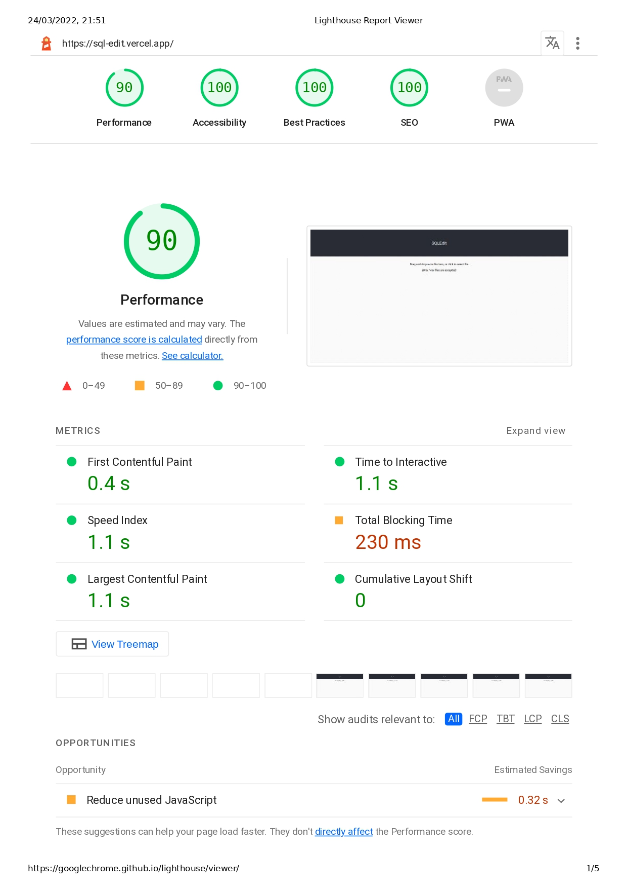

# SQLEdit

A simple SQL Editor+Selector built with React.

## Demo

Hosted on Vercel : [SQLEdit](https://sql-edit.vercel.app/)

## Requirements

- yarn

## Tech Stack

- react
- typescript
- react-ace
- styled-components
- react-table
- papaparse

## How to run:

1. [Clone](https://github.com/ron-debajyoti/SQLEdit) the Repository.
2. Run `yarn install` to install the project dependencies.

3. Run `yarn start` to run the app in development mode.

4. App can be seen at: `http://localhost:3000/`

## Features:

- Dropzone section to automatically upload csv files.
- Users can fetch data from any no. of columns in the table, either by using SQL Editor or the Dropdown buttons.
- Users can sort data directly by clicking the Header title of the column.
- Navigation between table is supported, in case of large data files.

## Performance:

The page load time of my website in desktop is in the range of 0.4 s to 1.1s, with total blocking time of 230ms.
The performance and load time of is calculated using [Lighthouse Tool](https://developers.google.com/web/tools/lighthouse).

### Steps taken to Optimize

- Using react.memo() for optimizzing the render performance of the data table after downloading the data, or after running queries.
- Only imported used modules in a component from library rather than importing whole library.
- Used vercel to deploy this website to which is a lot faster compared to Heroku, Netlify and other hosting services.
